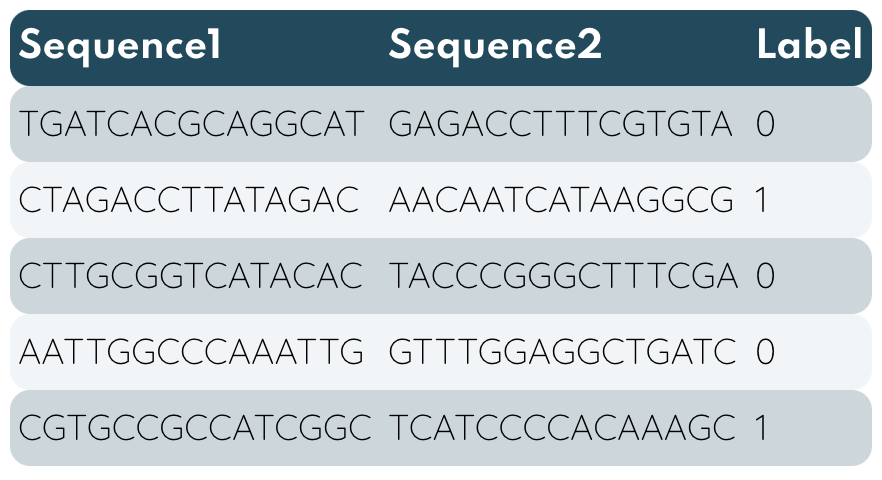

<!-- PROJECT LOGO -->
<br />
<p align="center">
    
  </a>

  <h3 align="center">Fine-Tuning Transformer Albert </h3>

  <p align="center">
    <a href="https://github.com/"><strong>Explore the wiki »</strong></a>
    
</p>


<!-- TABLE OF CONTENTS -->
<details open="open">
  <summary>Table of Contents</summary>
  <ol>
    <li>
      <a href="#about-Albert">About Albert</a>
      <ul>
        <li><a href="#model-advantages">Model advantages</a></li>
      </ul>
    </li>
    <li>
      <a href="#getting-started">Getting Started</a>
      <ul>
        <li><a href="#colab-setup">Colab Setup</a></li>
        <li><a href="#preprocessing-and-data-locating">Preprocessing and Data Locating</a></li>
        <li><a href="#dependencies">Dependencies</a></li>
      </ul>
    </li>
    <li><a href="#tokenization-&-input-formatting">Tokenization & input Formatting</a>
    </li>
    <ul>
        <li><a href="#special-tokens">Special Tokens</a></li>
        <li><a href="#aptamer-length">Aptamer Length</a></li>
      </ul></li>
      <li><a href="fine-tuning">Fine-tuning</a>
    </li>
    <li><a href="#model-optimization">Model optimization</a><ul>
        <li><a href="#onnx-framework">ONNX framework</a></li>
      </ul>
    </li>
    <li><a href="#further-improvements">Further Improvements</a>
    </li>
    <li><a href="#additional_information">Additional information</a>


  </ol>
</details>


<!-- ABOUT THE PROJECT -->
## About BERT
TODO
- [ ] JEI BUS LAIKO PAEKSPERMENTUOTI SU PRECISION IR SUTVARKYTI APPENDIX
- [ ] PAKEISTI LENTELES SU GERU CSS FORMATU
- [ ] SUDELIOTI ITALICIR BOLD SRIFTUS
- [ ] 
 
2018 was a breakthrough year for NLP, multiple new models like OpenAI's Open-GTP, Google's BERT allowed researchers to fine-tune existing models to produce state-of-art performance with minimal effort. LSTM have became largely replaced by BERT (Bidirectional Encoder Representations from Transformers) which was released in late 2018, because of transformers property of transfer learning which scales even further with open-source new model deployed, for instance in [*HuggingFace*](https://huggingface.co). Generally, using a pre-trained network can be used if datasets have something in common, so instead of training the neural network from scracth, which can take up to week to train and big bill of expensive GPU, we "transfer" the learned features. Simply put, you use it as a starting point. To consider, Natural Language Processing (NLP) models for sequence classification archieve ~ 85% accuracy, therefore proteins "language" is quite the same as languages we speak so we expect decent results.

In this project, we will be using BERT modification a Lite BERT (Albert) that incorporated parameter-reduction techniques to avoid memory limitations of available software, hence has multiple times less parameters to learn and can be trained, fine-tuned or used for inference from 2 to 3 times faster. However training Albert is time consuming and resource expensive process hence we consider only fine-tuning existing models. Luckily, Albert is able to archieves only slightly worse performance than BERT. Multiple IGEM teams have tried to apply well-established deep learning methods like CNN, LSTM to predict features of biological sequences, however those architectures have gradient flaws that especially reveal itself in long sequences. Lets consider why transformers have an edge over former models.


### Model advantages

* **Quick Development**
  - Compared to LSTM, BERT has a property of transfer learning, that means you don't have to train model lower layers from scratch, just to apply *head-layer* that suits your task, to get state-of-art results. 

* **Less Data**
  - Best performing deep learning models have millions of parameters to train, therefore model from scratch requires immense size datasets, a lot of time, and hands to create dataset.
  
* **Better Results**
    - It was shown that simple fine-tuning, by adding one layer on the top of BERT, can archieve state-of-art results with minimal task-specific adjustments and it does not suffer from vanishing/exploding gradient (RNN ilness). As a consequence BERT can handle long sequences.

* **Completely Exhaust GPU resources**
    - RNN, LSTM were hardly parallelizable because of recurrent-like architecture, to avoid issue BERT employed the new [attention link] methodology that lets BERT to fully parallelize computations. *Albert code is written to support multiple GPUs

## Getting Started 

### Colab Setup
Google Colaboratory offers free GPUs which is perfect to train large neural networks like Albert. To add GPU select on menu:

`Edit -->  Notebook Settings --> Hardware accelerator --> (GPU)`

This Framework has some time and resource drawbacks if training dataset is huge or *large* Albert architecture is chosen, hence we used Google Colaboratory Pro to speed up the process.


### Preprocessing and Data Locating
Model input must follow standard norms - **(Sequence1, Sequence2, Label)**. In case you have a list of sequences from **EFBA** you have to run it through *Python* script *./functions/pairing.py* to generate labeled dataframe for training.

* Pairing aptamers to fit it into *Albert*
  ```sh
  python pairing.py -d aptamerListCSV
  ```
* Output format
<p align="center">
    
</a>


### Dependencies

To use a pre-trained transformer *HuggingFace* :hugs: provides API to quickly download and use those on a give dataset. API contains thousands of pretrained models to perform many tasks including all *BERT* modifications, however in our case we employed *Albert* for sequence classification. More information on *pytorch interface*(https://pypi.org/project/transformers)

* Install transformers
  ```sh
  !pip install transformers
  ```

* Download and use model
  ```sh
  from transformers import AutoTokenizer, AutoModel

  tokenizer = AutoTokenizer.from_pretrained(bert_model) 
  bert_model = AutoModel.from_pretrained(bert_model)
  ```

## Tokenization & input Formatting
----
Required formating:
  - *Special* tokens at the beginning and ending of each sentence.
  - Padding & truncation to a single constant length. (papildyti)
  - Differ *real* tokens from *padding* tokens with attention mask.

### Special Tokens

`[CLS]` - For classification tasks, this token is appended in the beginning of first sentence. The significance of this token appears after all embeddings and produce classifier value - prediction.

`[SEP]` - Appears in the ending of *every* sentence and is given to seperate sentences to help model determine something.

`[PAD]` - Is used to balance every input sequence lenghts.

<p align="center">
    
  </a>

* How it looks in our case
  ```sh
  print("Original input: 'ACGTTGAACG', 'CGTTTCGAAT' ")
  print('Tokenized: ', tokenizer("ACGTTGAACG", "CGTTTCGAAT")['input_ids'])
  print('Seperating sequences: ', tokenizer("ACGTTGAACG", "CGTTTCGAAT")['token_type_ids'])
  ```

   ```sh
  Original input: 'ACGTTGAACG', 'CGTTTCGAAT' 
  Tokenized:  [2, 21, 15123, 38, 38, 1136, 1738, 263, 3, 13, 15123, 38, 38, 6668, 1136, 721, 3]
  Seperating sequences:  [0, 0, 0, 0, 0, 0, 0, 0, 0, 1, 1, 1, 1, 1, 1, 1, 1]
  ```

### Aptamer Length

In case, dataset consists of varying length aptamers we have to consider two *Albert* constraints:

* Every aptamer pair must be padded or truncated to a same, fixed length.

* The maximum lump length can't exceed 512 tokens.

 However, keep *max_len* as small as possible since training time approximaly linearly dependent on this parameter.


## Fine-tuning

Following good practice, data was divided up in *train*, *test*, *validation* groups with *80%*, *10%*, *10%* percentage of data respectively, refer to `./functions/pairing.py` to follow algorithm.
Next, an *iterator* for our dataset using *torch DataLoauder* class is created, which helps to save memory compared to simply data looping which stucks whole loaded data to memory.

* train, validation datasets
  ```sh
  train_loader = DataLoader(train_set, batch_size=bs, num_workers=1)
  val_loader = DataLoader(val_set, batch_size=bs, num_workers=1)
  ```
  Machine with GPU has multiple cores, this means that the next batch can already be loaded and ready to go by the time the main process is ready for another batch. This is where the *number_of_workers* comes and speeds up, batches are loaded by workers and queued up in memory.  Optimal number of workers is equal 1. [More information](https://deeplizard.com/learn/video/kWVgvsejXsE)

Model can be fine-tuned differently in many ways: feature extraction, train only part of layers and so on, in case, you want to read more on how fine-tuning works we strongly recommend reading the tutorial: [transfer-learning-the-art-of-fine-tuning-a-pre-trained-model](https://www.analyticsvidhya.com/blog/2017/06/transfer-learning-the-art-of-fine-tuning-a-pre-trained-model/).


## Model optimization
Transformers and transformers-like achitectures have taken over many sequence related field with de-facto state-of-art performance, however it comes with high computational cost which is a burden for inference, usage of model in applications. There are few possible ways to optimize and speed-up it withoutinvesting into expensive hardware:

  - **Model pruning** - Reduce the number of layers, hidden layers units or the dimension of the embeddings.
  - **Quantization** - Sacrife model weights precision, use lower 16/8-bit precision isntead of 32-bit.
  - **Exporting** - *PyTorch* model can be transfered to more appropiate format or inference engine, for instance *Torchscript*, *ONNX*
  - **Better hardware** - by [research](https://timdettmers.com/2018/10/17/tpus-vs-gpus-for-transformers-bert/) fine TPUs, for instance, TPU v2.8 is about 32% to 54% faster that GPUs.
  - **Batching** - predict bigger bataches of samples instead of individual samples.

First two requires fine-tuning and pretraining from scratch respectively, the last one was applied in our model, hence we will optimize inference time by exporting *Albert* to *ONNX* or *Torchscript*. Let's investigate the most suitable technique because inference time is extremely important.

### ONNX framework
On average model converted to ONNX framework is running approximally 3 times faster, this means that the NN is able to compare 1000 aptamers and find top 300 times faster than **EFBA**

Follow in-depth explanation how Pytorch model converting to ONNX works in [tutorial](https://www.youtube.com/watch?v=7nutT3Aacyw&t=859s).


## Additional information
  - Optimizer & Learning Rate Scheduler [1](https://towardsdatascience.com/7-tips-to-choose-the-best-optimizer-47bb9c1219e), [2](https://towardsdatascience.com/7-tips-to-choose-the-best-optimizer-47bb9c1219e).


  - Weight Decay [1](https://medium.com/analytics-vidhya/deep-learning-basics-weight-decay-3c68eb4344e9).


   


